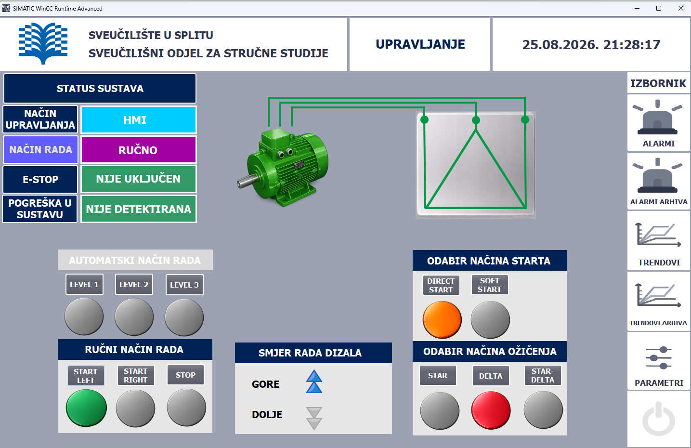
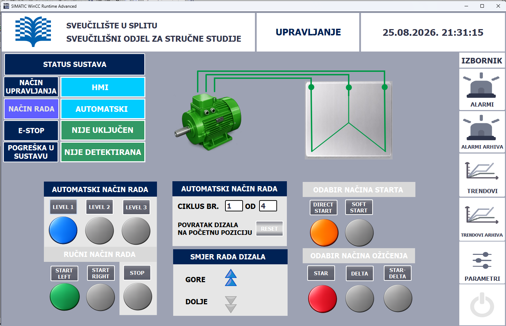
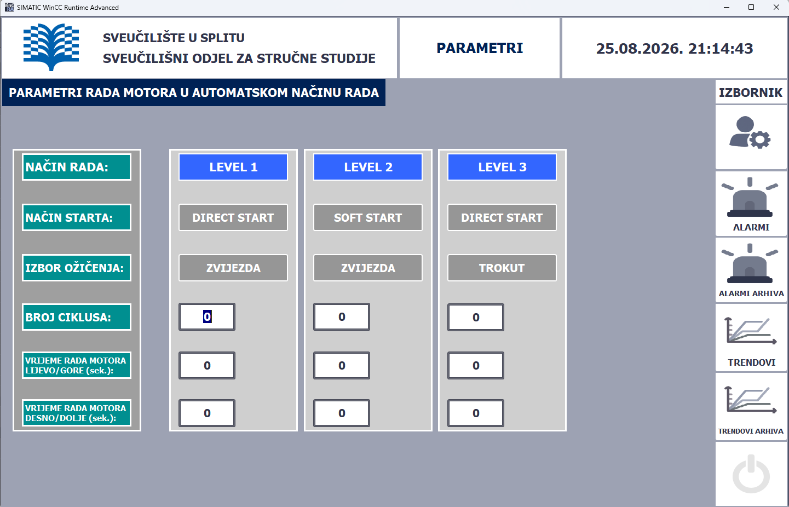
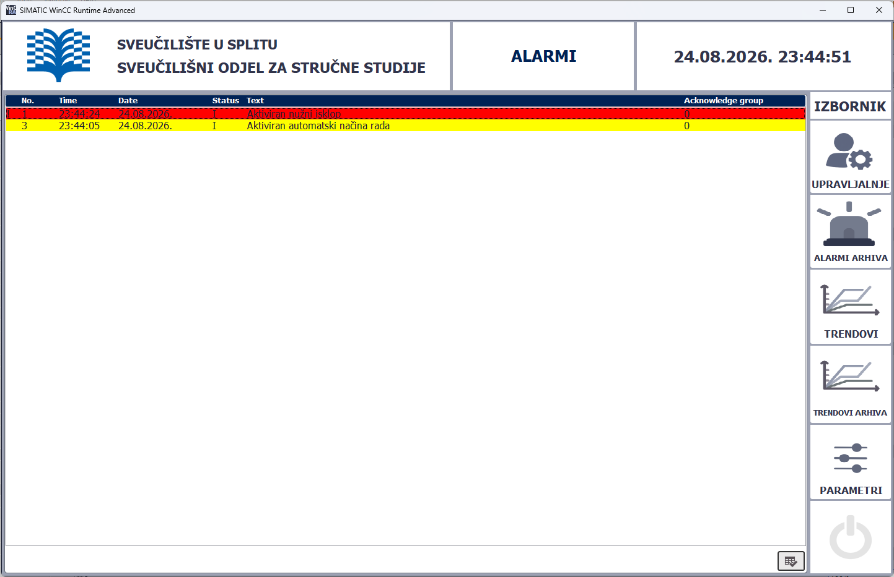
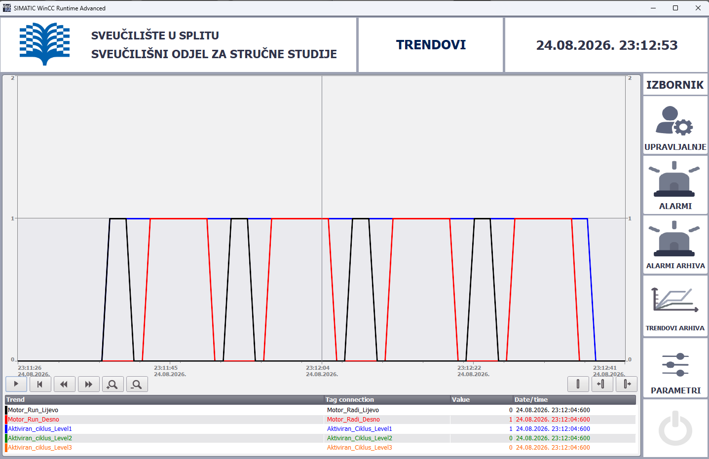
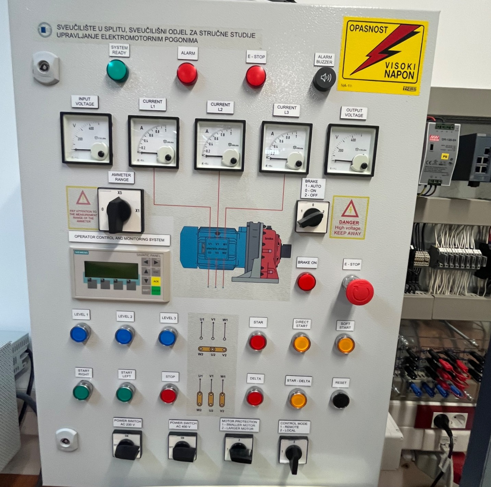

# PLC Induction Motor Control System

Diploma project developed using Siemens SIMATIC S7-1200,
TIA Portal V15 and WinCC Runtime Advanced.

The project includes PLC control and HMI visualization of a
three-phase induction motor.

## Technologies

- Siemens SIMATIC S7-1200
- CPU 1214C DC/DC/DC
- TIA Portal V15
- WinCC Runtime Advanced
- PROFINET
- SCL programming

## Main Features

- Manual and automatic motor control
- Left and right rotation
- Direct start and soft-start
- Star connection
- Delta connection
- Star-delta starting
- Safety interlocks
- Fault detection
- Emergency stop logic
- HMI control and monitoring
- Alarm visualization
- Trend visualization and archiving
## PLC Program Structure

The PLC program is modularly organized into several functions:

- `FC_SYS_BLOK` – motor direction control, starting method selection,
  winding configuration and fault detection
- `FC_SIM` – simulation and testing of PLC logic
- `FC_OPC_NAM` – verification of basic operating conditions
- `FC_UPR_MOTOROM` – motor control logic
- `FC_HMI` – data exchange between PLC and HMI
- `FC_AUTOMATIZACIJA` – automatic operating cycle

## HMI Visualization

The HMI application was developed using WinCC Runtime Advanced.

Main HMI screens:

### Manual Mode

### Automatic Mode

### Parameters

### Alarms

### Trends

## Project Panel

The HMI communicates with the Siemens S7-1200 PLC through PROFINET.

## Source Code

- [FC_SYS_BLOK – SCL source](src/FC_SYS_BLOK.scl)

## Experimental Measurements

Laboratory measurements were performed on a three-phase induction motor.

Measured variables:

- Motor current `I(t)`
- Motor voltage `U(t)`
- Motor speed `n(t)`

Tested motor configurations:

- Star connection at 230 V
- Star connection at 400 V
- Delta connection at 230 V
- Star-delta starting at 230 V

### Measurement Results

| Motor configuration | Maximum current |
|---|---:|
| Star 230 V | approximately 1.5–1.6 A |
| Star 400 V | approximately 1.8 A |
| Delta 230 V | approximately 3.2 A |
| Star-Delta 230 V | approximately 1.9 A during transition |

The measurements were performed without additional mechanical load.

## Documentation

Full PLC program documentation and TIA Portal code export:

[View PLC Code Documentation](docs/TIA_Portal_Full_Code.pdf)

## Project Files

The repository contains:

- PLC source code
- TIA Portal documentation
- HMI screenshots
- Experimental measurement results
- Project images

## Project Context

This project was developed as a graduate thesis and laboratory automation project.
It demonstrates practical experience with PLC programming, HMI development,
industrial communication and induction motor control.

## Author

Ivan Gudelj

Graduate thesis project – PLC Automation of an Induction Motor Control Panel
